# pythonchik

0. # Есть словарь координат городов
sites = {

    'Moscow': (550, 370),

    'London': (510, 510),

    'Paris': (480, 480),

}
Составим словарь словарей расстояний между ними

расстояние на координатной сетке - ((x1 - x2) ** 2 + (y1 - y2) ** 2) ** 0.5

Я создал словарь с каждым городом, после внутри словаря сделал словарь к каждому городу и рассчитал расстояние по данной в самом задании формуле: 
	
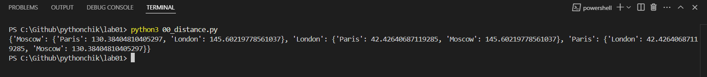

1.  Есть значение радиуса круга
radius = 42
Далее, пусть есть координаты точки
point_1 = (23, 34)
где 23 - координата х, 34 - координата у
Если точка point лежит внутри того самого круга центр в начале координат (0, 0), radius = 42,
то выведите на консоль True, Или False, если точка лежит вовне круга.

Я нашел площадь круга с точностью до 4-х знаков, проверил лежат ли точки внутри круга:
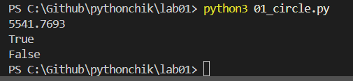

2.  Расставьте знаки операций "плюс", "минус", "умножение" и скобки
между числами "1 2 3 4 5" так, что бы получилось число "25".\

Расставил знаки в правильном порядке:

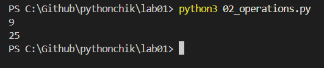

3. Есть строка с перечислением фильмов
my_favorite_movies = 'Терминатор, Пятый элемент, Аватар, Чужие, Назад в будущее'
Выведите на консоль с помощью индексации строки, последовательно:
первый фильм
последний
второй
второй с конца

Вывел в консоль фильмы с помощью индексации: 

!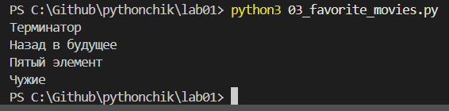

4. Нужно было создать список семьи, после сделать список списков роста членов семьи, а после вывести рост отца и общий рост всей семьи.

Создал список семьи, сделал список списков роста, а после вывел рост отца и общий рост семьи:
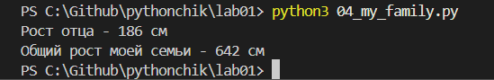

5. Был список животных в зоопарке, нужно было посадить медведя между львом и кенгуру, а после вывести на консоль. После добавить птиц в последние клетки зоопарка и вывести список, убрать слона, вывести список повторно и в конце вывести в какой клетки сидит лев и жаворонок:

Выполнил все по заданию:

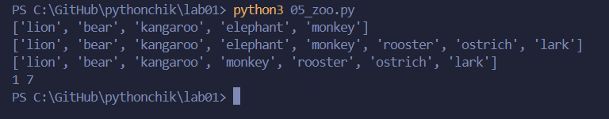

6. Есть список песен группы Depeche Mode со временем звучания с точностью до долей минут распечатайте общее время звучания трех песен: 'Halo', 'Enjoy the Silence' и 'Clean' в формате
	Три песни звучат ХХХ.XX минут
и распечатайте общее время звучания трех песен: 'Sweetest Perfection', 'Policy of Truth' и 'Blue Dress'
	А другие три песни звучат ХХХ минут

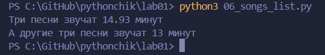

8. Есть зашифрованное сообщение. Нужно его расшифровать и вывести на консоль в удобочитаемом виде. Должна получиться фраза на русском языке, например: как два байта переслать.

Расшифровал и вывел на консоль:

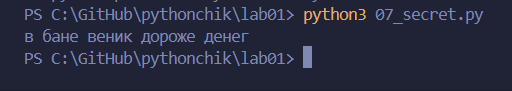

8. В саду и лугу сорвали цветы, нужно было вывести множество этих цветов, все виды которые растут и там и там, которые растут в саду, но не растут на лугу, которые растут на лугу, но не растут в саду.

Вывел множество цветов и так далее:

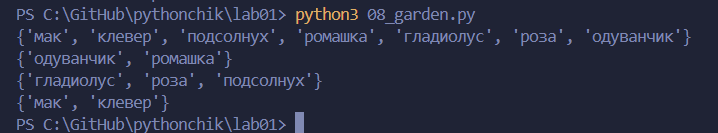

9.Есть словарь магазинов с распродажами, нужно создать словарь цен на продукты

Создал словарь цен на продукты:

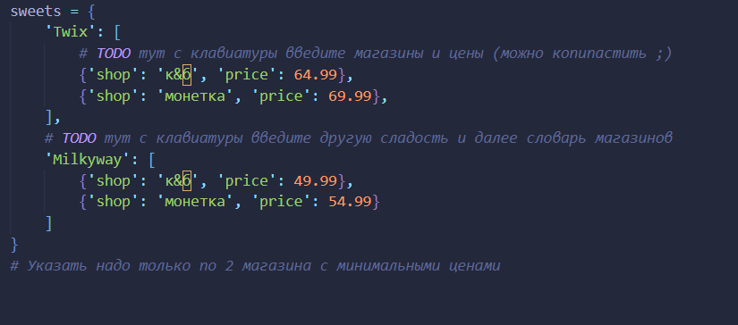

10. Есть словарь кодов товаров и есть словарь списков количества товаров на складе. Рассчитать на какую сумму лежит каждого товара на складе и вывести стоимость каждого вида товара на складе.

Рассчитал стоимость каждого вида товара на складе и вывел стоимость каждого:

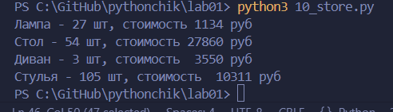
