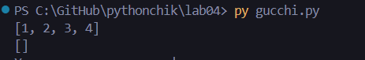
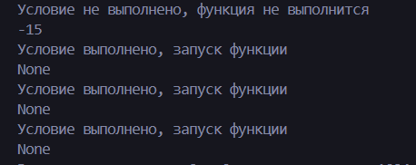

# Лабораторная работа № 4
## Задание №1
	Нужно было создать замыкание для накопления всех аргументов в коллекции, а при получении определённого значения - возврат и очистка коллекции.

Создал замыкание для накопления аргументов с списком внутри и сделал проверку на наличие стоп-слова.


## Задание №2
В нем нужно было создать декоратор для валидации аргументов функции с помощью условий:

```python
@validate(lambda x: x > 0, lambda y: isinstance(y, str))
def my_function(x, y):
    pass
```
Создал декоратор, который получает параметры условий для обработки, а также выполняет проверку этих самых условий: если условие выполнится, то вернется функция которая обернута в декоратор, если нет, то вернется произведение параметров



# Список использованных источников:
[Декораторы Python: пошаговое руководство](https://habr.com/ru/companies/otus/articles/727590/)

[Замыкания в Python: примеры использования](https://habr.com/ru/articles/862692/)
