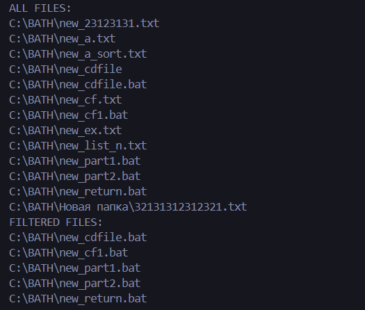
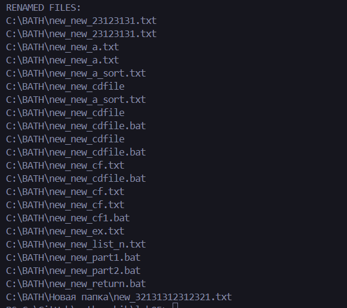

# Лабораторная работа № 5
Нужно было создать генератор, который обходит файловую систему в указанном каталоге и возвращает имена файлов с заданным расширением. Предусмотреть возможность обхода подкаталогов. Переименуйте найденные файлы.

Я создал генератор, в котором прохожу по директории и возвращаю путь. Также создал отдельную функцию, которая изменяет имя. В итоге вывел все файлы, прошелся с помощью фильтра по файлам и вывел отфильтрованные файлы, а также переименовал их с помощью функции map().

# Список литературы:
[Генераторы в Python](https://skillbox.ru/media/code/generatory_python_chto_eto_takoe_i_zachem_oni_nuzhny/)
[Функция os](https://docs-python.ru/standart-library/modul-os-python/)
