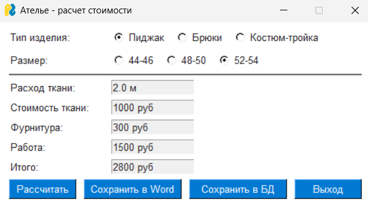
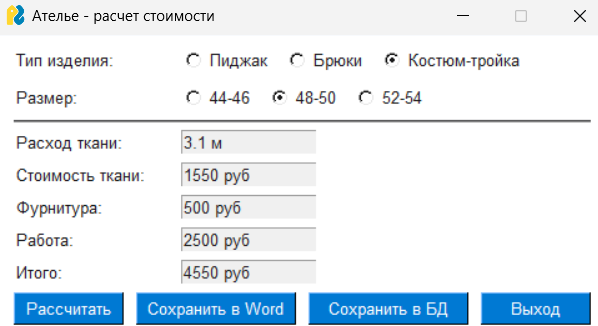
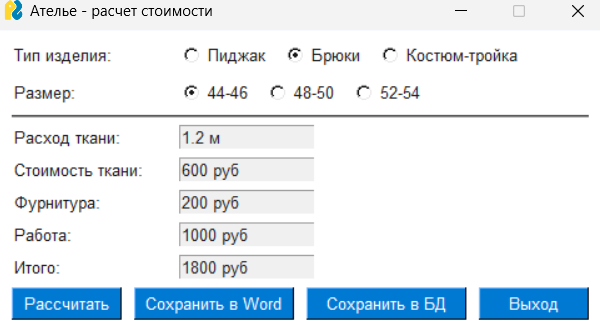

# Лабораторная работа №6
Нужно было создать графический пользовательский интерфейс с расчётом расхода ткани в зависимости от размера, расчётом стоимости пошива, учитывая расход ткани и фурнитуры для одежды.

Я создал интерфейс с помощью библиотеки PySimpleGUI, в нем я предоставляю выбор желаемого изделия и размер для расчёта стоимость пошива изделия. Результаты отображаются в рамках интерфейса, также их можно сохранить в формате word и в БД.

# Список литературы:
[Запускаем PostgreSQL в Docker](https://habr.com/ru/articles/578744/)

[PySimpleGUI](https://docs.pysimplegui.com/en/latest/)
